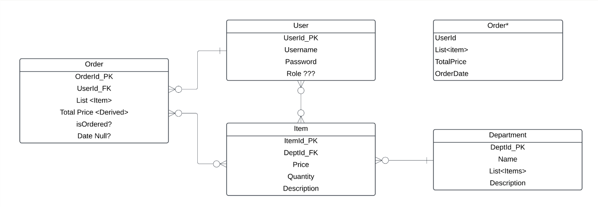

# Team4.FRONTEND

E-Commerce Portal:
User - centric Portal

Team Members:
Alex Piccolo
Ethan Catania
Jude Hoekstra
Vamsi Gurram

Front End:

    1. User should be able to login. Simple auth.
    2. User hits the page and see home page, with Top Navigation Bar, listing different categories
        a. By default, we list all items in main Window frame.
        b. Menu --> drop down list (categories), cart,  Subscribe (ON/OFF) for better deals
    3. Once user selects a category, then main frame/window displays list of products and their inventory count, Price, for the selected category.

    4. User selects an item and adds to the cart for checkout.
        a. If inventory count <=0, then we should display "Out of stock". Display "Out of Stock" Label.

    5. User checks-out the selected item.
        a. Once checkout is completed, display message that items will be shipped via Courier.
        b. While checking out, use the 3rd party API, to check if Postal address is correct or NOT.

Stretch Goal:

    1. Search Bar
    2. User Login via authentication provider
    3. Add the sub-categories for the list in the Navigation Bar.
    4. Add Credit card authentication

Database:

ERD Diagram:

Back-End Code: C#

Controller:

1. List all users (GET ALL)
2. Add user (POST User)
3. Check_UserCreds() (GET user_name/password)
4. List All Departments (GET)
5. List All Items in DepartmentById (GET {id})
6. List an ItemById(GET {id})
7. Get ItemsInStock(Get)
8. AddItemToCart(POST {Item})
9. DeleteItemFromCart(Delete)
10. UpdateItemInCart(Patch )
11. GetItemsTotal()
12. GetOrderStatus(GET OrderID)
13. CompleteCheckout()

Xunit Test:
Test cases

Work Distribution:
